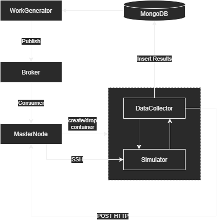
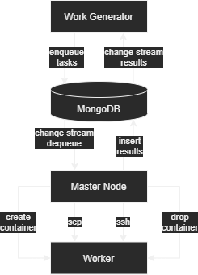

# ScalableSimulationSystem

🌍 *[English](README.md)*

ScalableSimulationSystem é um conjunto de ferramentas para o estudo e implementação de simulações distribuídas escaláveis, utilizando tecnologias como Docker, Kafka, MongoDB, SSH e Golang. Este repositório apresenta diferentes exemplos de arquiteturas para a execução eficiente de simulações distribuídas.

## 📌 Visão Geral
O repositório está estruturado da seguinte forma:

```
ScalableSimulationSystem/
│── examples/
│   │── DockerSimGrid/
│   │── GoMongoQueue/
│── docs/
│── LICENSE
│── README.md
```

Cada projeto dentro de `examples/` implementa uma abordagem específica para execução de simulações escaláveis:

### 🛠 DockerSimGrid
- Utiliza **Docker** para execução distribuída de simulações.
- Comunicação assíncrona com **Kafka**.
- Gerenciamento remoto via **SSH**.

### 📌 Esquemático conceitual da arquitetura:



📂 **Localização:** `examples/DockerSimGrid/`

📜 [Leia mais sobre DockerSimGrid](examples/DockerSimGrid/README.md)

---

### 🛠 GoMongoQueue
- Baseado em **Go** e **MongoDB Change Streams** para controle de fila de simulações.
- Sistema de tarefas distribuídas sem necessidade de Kafka.
- Simples e eficiente para execução de simulações controladas via banco de dados.

### 📌 Esquemático conceitual da arquitetura:



📂 Localização: `examples/GoMongoQueue/`

📜 [Leia mais sobre GoMongoQueue](examples/GoMongoQueue/README.md)

---

## 🚀 Como Usar

1. **Clonar o repositório:**
```sh
git clone https://github.com/JunioCesarFerreira/ScalableSimulationSystem
cd ScalableSimulationSystem
```

2. **Acessar um dos exemplos disponíveis:**
```sh
cd examples/DockerSimGrid
# ou
cd examples/GoMongoQueue
```

3. **Seguir as instruções específicas em cada projeto para configuração e execução.**

## 📜 Licença
Este projeto está licenciado sob a [Licença MIT](LICENSE).

